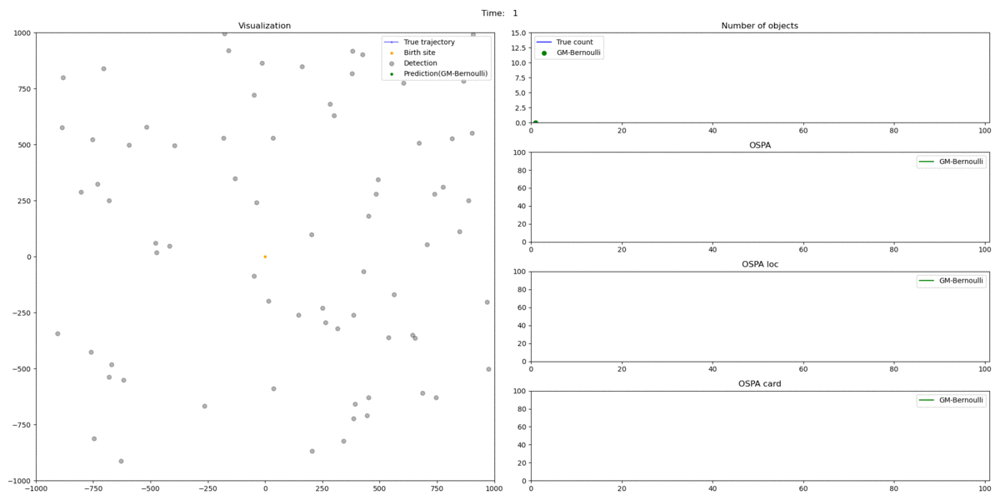

# trackun

A Python package for (multiple) object tracking using recursive Bayesian filtering

## **Demo**

**Example 1**: GM-Bernoulli filter for single-object tracking on Constant Velocity with Gaussian noise model

```bash
python demo.py -s -m linear_gaussian -f GM-Bernoulli -o vis/output
```

<details>
  <summary>Click to expand</summary>



</details>

**Example 2**: GM-PHD and GM-CPHD filter for multi-object tracking on Constant Velocity with Gaussian noise model

```bash
python demo.py -m linear_gaussian -f GM-PHD GM-CPHD -o vis/output
```

<details>
  <summary>Click to expand</summary>


</details>

## **Checklist**

<details>
  <summary>Click to expand</summary>

### **Filters**

<details>
  <summary>Click to expand</summary>

- [ ] Single Object
  - [ ] Kalman Filter (GMS)
  - [ ] Particle Filter (SMC)
  - [ ] Extended Kalman Filter (EKF)
  - [ ] Unscented Kalman Filter (UKF)
- [ ] Bernoulli
  - [x] Kalman Filter (GMS)
  - [ ] Particle Filter (SMC)
  - [ ] Extended Kalman Filter (EKF)
  - [ ] Unscented Kalman Filter (UKF)
- [ ] Probability Hypothesis Density (PHD)
  - [x] Kalman Filter (GMS)
  - [ ] Particle Filter (SMC)
  - [ ] Extended Kalman Filter (EKF)
  - [ ] Unscented Kalman Filter (UKF)
- [ ] Cardinalized Probability Hypothesis Density (CPHD)
  - [x] Kalman Filter (GMS)
  - [ ] Particle Filter (SMC)
  - [ ] Extended Kalman Filter (EKF)
  - [ ] Unscented Kalman Filter (UKF)
- [ ] Robust Probability Hypothesis Density (PHD)
  - [ ] Unknown clutter (Lambda-CPHD)
    - [ ] Kalman Filter (GMS)
    - [ ] Particle Filter (SMC)
    - [ ] Extended Kalman Filter (EKF)
    - [ ] Unscented Kalman Filter (UKF)
  - [ ] Unknown detection probability (pD-CPHD)
    - [ ] Kalman Filter (GMS)
    - [ ] Particle Filter (SMC)
    - [ ] Extended Kalman Filter (EKF)
    - [ ] Unscented Kalman Filter (UKF)
  - [ ] Unknown clutter rate and detection probability
    - [ ] Kalman Filter (GMS)
    - [ ] Particle Filter (SMC)
    - [ ] Extended Kalman Filter (EKF)
    - [ ] Unscented Kalman Filter (UKF)
- [ ] Cardinality Balanced Multi-target Multi-Bernoulli (CBMeMBer)
  - [ ] Kalman Filter (GMS)
  - [ ] Particle Filter (SMC)
  - [ ] Extended Kalman Filter (EKF)
  - [ ] Unscented Kalman Filter (UKF)
- [ ] Generalized Labeled Multi-Bernoulli (GLMB)
  - [x] Kalman Filter (GMS)
  - [ ] Particle Filter (SMC)
  - [ ] Extended Kalman Filter (EKF)
  - [ ] Unscented Kalman Filter (UKF)
- [ ] Labeled Multi-Bernoulli (LMB)
  - [x] Kalman Filter (GMS)
  - [ ] Particle Filter (SMC)
  - [ ] Extended Kalman Filter (EKF)
  - [ ] Unscented Kalman Filter (UKF)
  
</details>

### **Models**

<details>
  <summary>Click to expand</summary>

#### Motion model

- [ ] Linear Gaussian
  - [x] Constant velocity
- [ ] Non-Linear Gaussian
  - [x] Coordinated turn (CT)

#### Measurement model

- [ ] Linear Gaussian
  - [x] Cartesian coordinate
- [ ] Non-Linear
  - [x] Bearing/Polar coordinate

#### Other models

- [ ] Birth model
  - [x] Multi-Bernoulli Gaussian
  - [x] Multi-Bernoulli Gaussian Mixture
- [ ] Detection model
  - [x] Constant probability
  - [x] Bearing Gaussian
- [ ] Survival model
  - [x] Constant probability
- [ ] Clutter model
  - [x] Uniform clutter
  
</details>

### **Metrics**

- [x] OSPA
- [ ] OSPA2

### **Utility**

- [ ] Examples and Visualization
- [ ] Benchmarking
- [ ] Optimization (consider memory-speed tradeoffs, JIT,...)
- [ ] System design and folder structure
- [ ] Testing

</details>

## **Credits**

Original MATLAB implementation comes from http://ba-tuong.vo-au.com/codes.html
